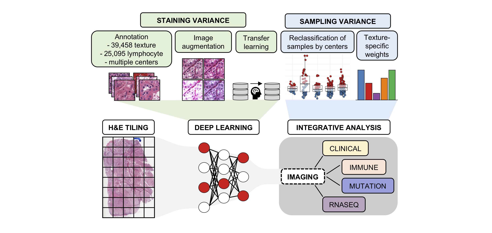

# Integrative Analysis of Tissue Textures and Lymphocyte Infiltration in Renal Cell Carcinoma using Deep Learning

## BACKGROUND
These codes will help you reproduce all plots and statistical analyses of the publication "Integrative Analysis of Tissue Textures and Lymphocyte Infiltration in Renal Cell Carcinoma using Deep Learning" by Brummer Otso et al.  

## USEFUL LINKS
**[CODE](https://github.com/vahvero/RCC_textures_and_lymphocytes_publication_image_analysis)** &emsp; &emsp; &emsp; &emsp; &nbsp; &nbsp; The image analysis pipelines to reproduce the texture and lymphocyte data.  
**[DATA](https://zenodo.org/record/7898308#.ZFSnZexBxTY)** &emsp; &emsp; &emsp; &emsp; &emsp; The annotated texture and lymphocyte image data are located in Zenodo.  
**[VISUALIZATION](http://hruh-20.it.helsinki.fi/rcc_texture_lymphocytes/)** &emsp; &nbsp;The TissUUmaps platform to visualize and assess the results of the image analysis pipelines.

## INSTRUCTIONS

### Instructions if you operate with RStudio
1. Install RStudio (the analyses here have been made with the version 3.5.1)
2. Install necessary R packages either by running the Rscript `./src/install_packages.R`
3. Run the analyses at once by running the Rscript `./src/main.R`. This will
- preprocessed data files are found in `./data/`
- produce tables and images in `./src/path/Images/`

### Instructions if you operate with the terminal
1. Install RStudio (the analyses here have been made with the version 3.5.1)
2. `cd ./RCC_textures_and_lymphocytes_publication_data_analysis`
3. `Rscript environment/install_packages.R`
4. Run the analyses at once by running `Rscript src/main.R`. This will
- preprocess data files found in `./data/`
- produce tables and images in `./src/path/Images/`

A detailed description of  the R and library versions can be found in `session_info.yaml`.
